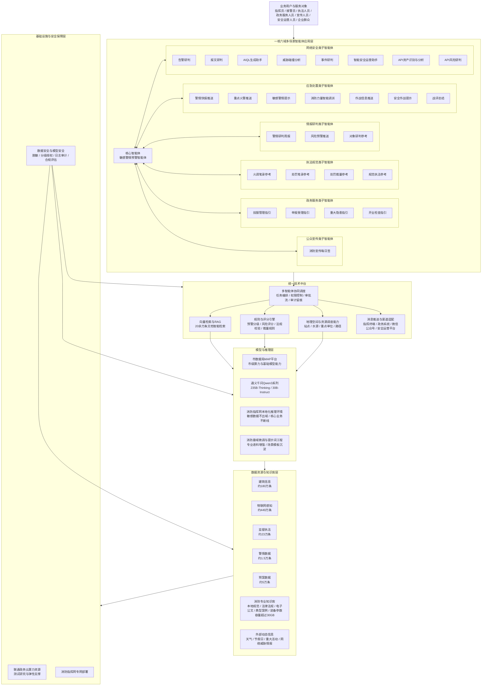
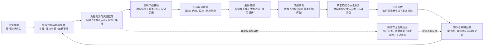
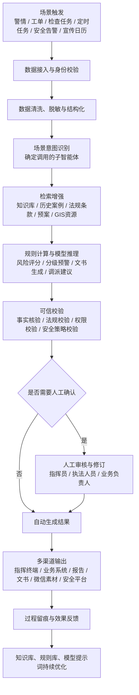
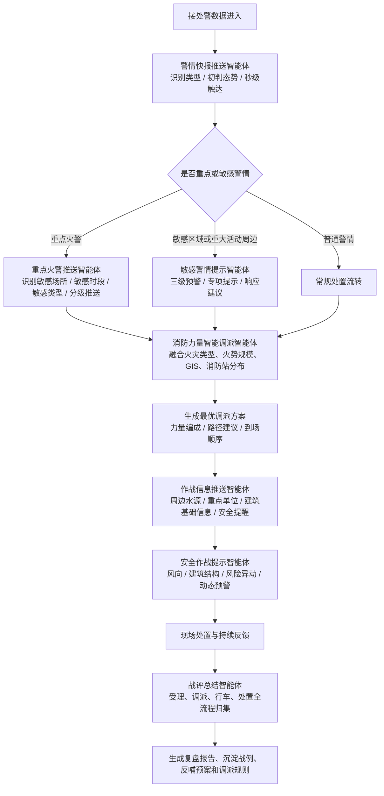
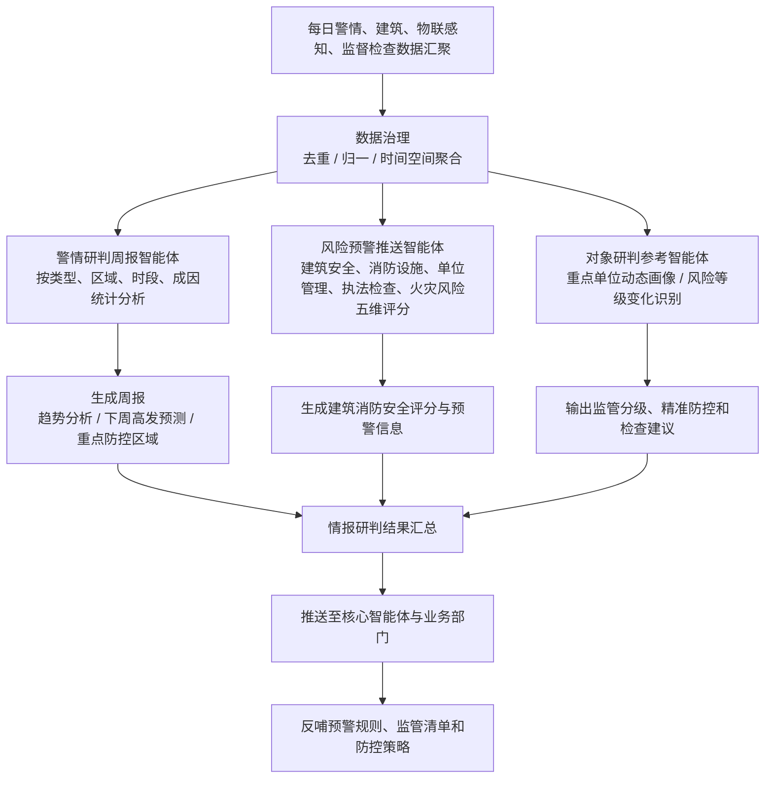
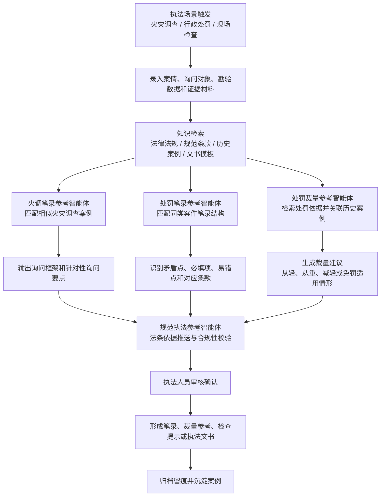
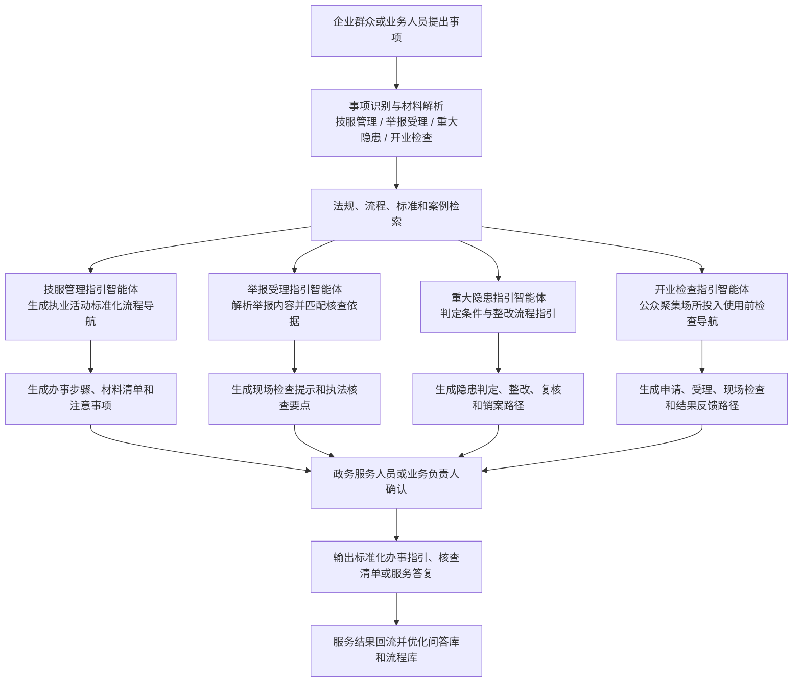
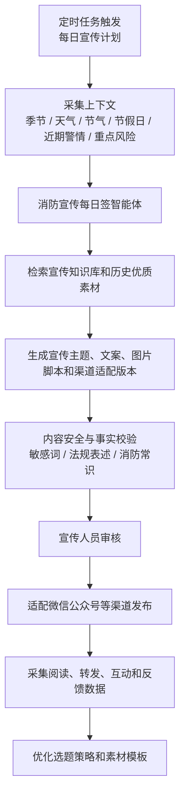
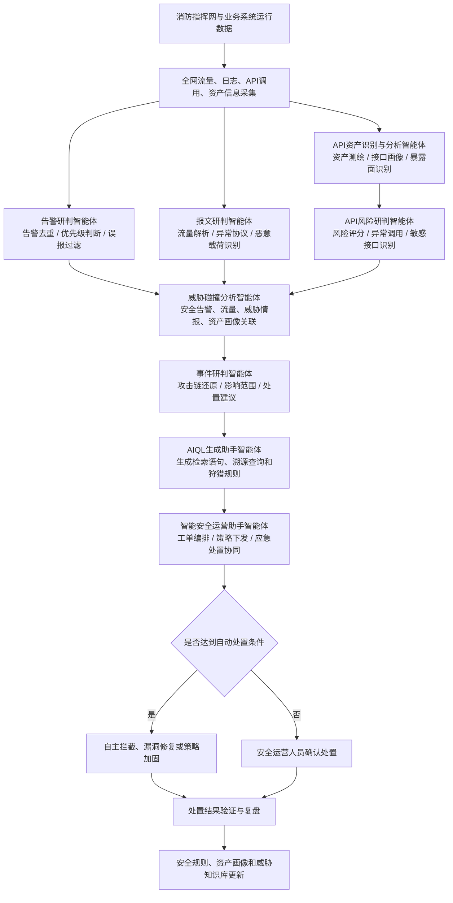
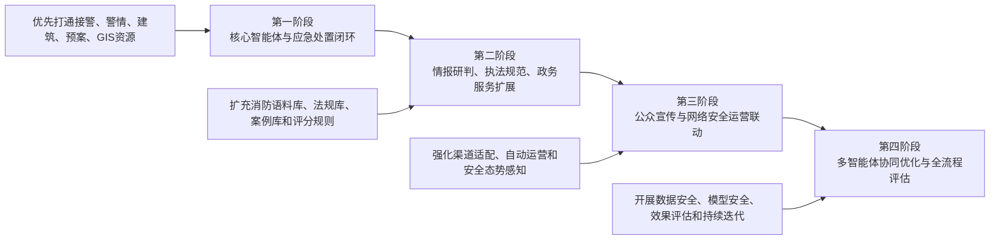

# 上海市消防救援局智能体系建设架构与子智能体流程图

> 根据《上海市消防救援局政务智能化应用场景情况汇报》整理。

## 1. 智能体系建设总体架构图

## 2. “接警调派—行动安全—总结研判—服务执法—社会宣传”闭环协同图

## 3. 子智能体通用实现流程图

## 4. 应急处置类子智能体实现流程图

## 5. 情报研判类子智能体实现流程图

## 6. 执法规范类子智能体实现流程图

## 7. 政务服务类子智能体实现流程图

## 8. 公众宣传类子智能体实现流程图

## 9. 网络安全类子智能体实现流程图

## 10. 建设实施建议图

